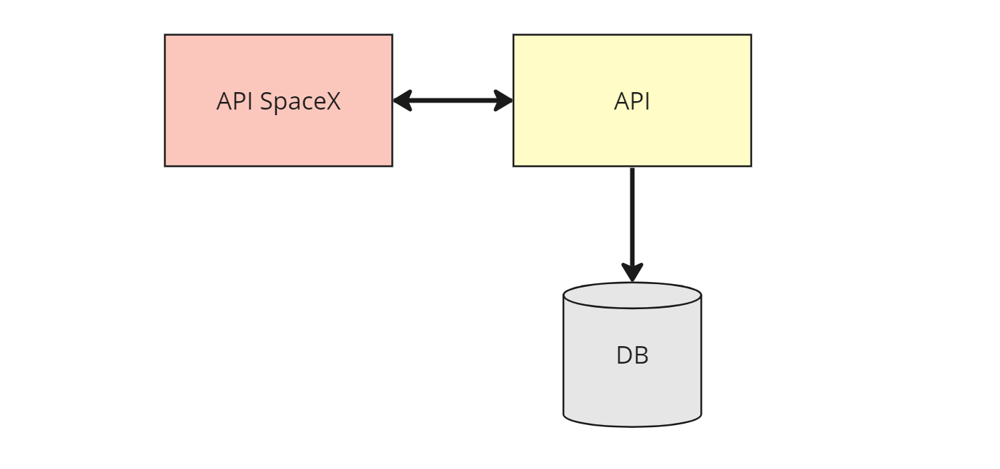
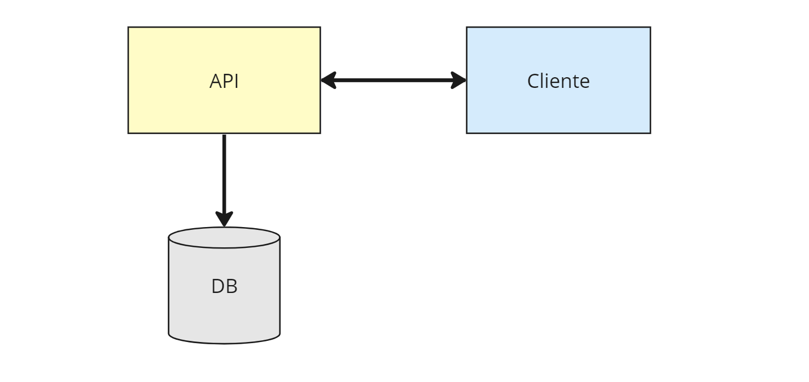

<div align="center">
<a href="https://www.salaryfits.com.br/">
    
</a>

&nbsp;&nbsp;
<h1 align="center">Desafio Node.js - Salary Fits</h1>
&nbsp;&nbsp;
</div>

## 🚀 Sobre o projeto


A API desenvolvido tem como objetivo fazer chamada para a API SpaceX, persistir os dados recebidos no banco de dados MySQL usando o Prisma e por fim retornar os dados lendo no banco de dados. As informações escolhidas para serem trabalhadas nas rotas foram sobre lançamentos passados e próximos lançamentos. A base de dados da V4 [SpaceX-API](https://github.com/r-spacex/SpaceX-API/tree/master/docs#rspacex-api-docs) teve sua última atualização no ano de 2022.


&nbsp;&nbsp;
## 🧰 Pré-requisitos

 - [Node.js](https://nodejs.org/en/)  
 - [VSCode](https://code.visualstudio.com/)  ou editor da sua preferência
 - [MySQL](https://www.mysql.com/)

&nbsp;
## 🔧 Tecnologias utilizadas

-  [Typescript](https://www.typescriptlang.org/docs/)
-  [Node.js](https://nodejs.org/en/docs)
-  [Express](https://expressjs.com/pt-br/)
-  [Prisma](https://www.prisma.io/)
-  [MySQL](https://www.mysql.com/)
-  [Zod](https://zod.dev/)
-  [Axios](https://axios-http.com/ptbr/docs/intro)

&nbsp;&nbsp;
## ☕ Estrutura do projeto
Ao iniciar a aplicação a API faz requisições para a API SpaceX e salva os dados recebidos no banco de dados.
<div  align="center">
</br>
    
</div>
</br>
A API fornece rotas para o cliente requisitar dados de lançamentos passados ou próximos lançamentos e também fazer algumas operações no banco de dados.
<div  align="center">
</br>
    
</div>

&nbsp;&nbsp;
## 🧭 Como executar o projeto?

```bash
# Clone este repositório
$ git clone https://github.com/lorraynefirme/API-SalaryFits.git

# Acesse a pasta do projeto no terminal/cmd
$ cd API-SalaryFits

# Instale as dependências 
$ npm install

# Preencha as variáveis de ambiente

# Execute para criar as tabelas no banco de dados
$ npm run createdb

# Execute a aplicação em modo de desenvolvimento
$ npm run start:dev
```

